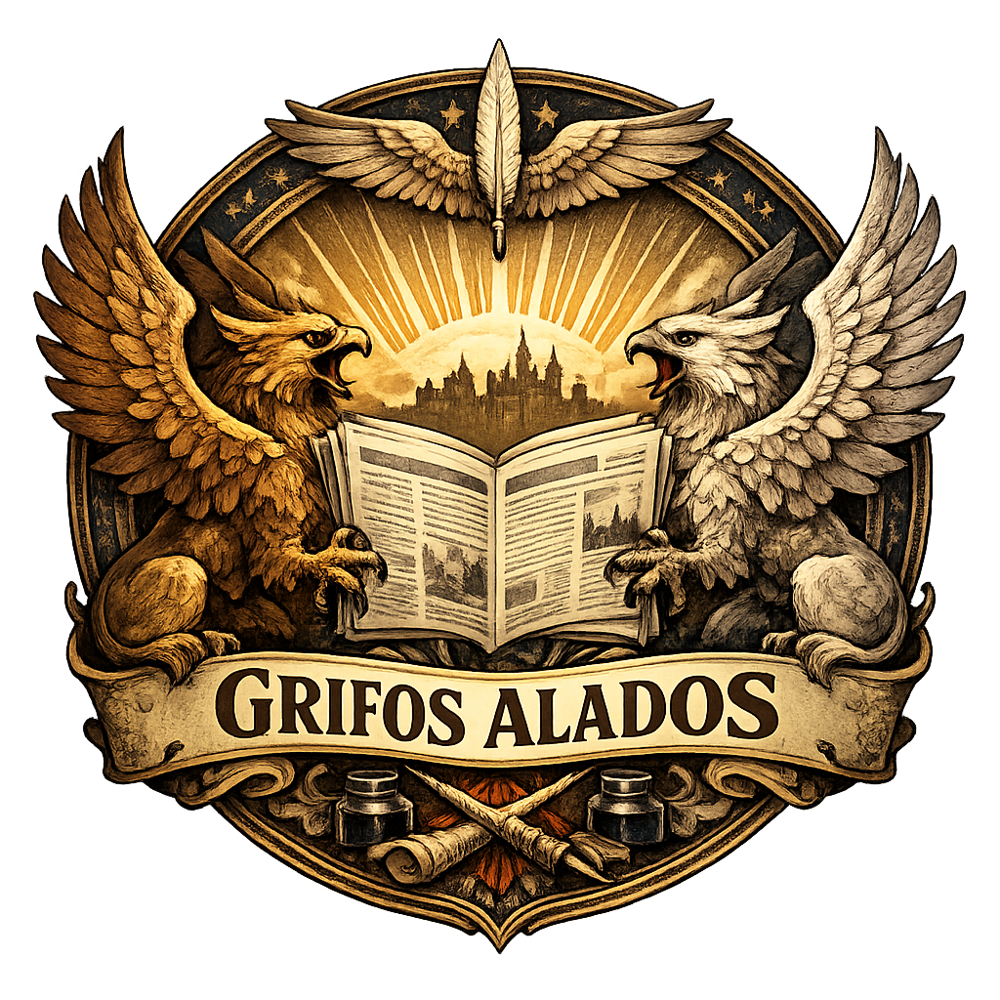

<div align="center">
  

  # 🦅 Grifos Alados

  **Ferramenta de mesa para mestres de _Tormenta 20_** — uma "gazeta de Arton" com geradores,
  bestiário, consultas de regras e organização de campanha, tudo em um site só.

  ### 👉 [**Acessar o site**](https://blafxd.github.io/Grifos-Alados/)

  _Não precisa instalar nem fazer login — é só abrir o link e usar._
</div>

---

## ✨ O que é

O **Grifos Alados** reúne, numa interface única no estilo de um jornal de Arton, as ferramentas
que um mestre de _Tormenta 20_ usa durante e entre as sessões. Roda inteiramente no navegador:
**sem servidor, sem cadastro e sem custo**. Os dados de cada pessoa ficam salvos no próprio
navegador, e cada aba tem botão de **backup `.json`** para você não perder nada.

## 🧰 Ferramentas (abas)

| Aba | O que faz |
|-----|-----------|
| 🎁 **Recompensas** | Sorteia dinheiro e itens por ND. Modo **Padrão (tabela oficial T20)** ou **Customizável** (filtros por categoria, pergaminhos como recompensa, itens superiores encantados, calculadora de ND de encontro). |
| 🏪 **Loja** | Gera o inventário de uma loja (itens normais, especiais e mágicos) e uma aba de **pergaminhos** com a regra do Escriba Arcano. Descrições e encantos com tooltip. |
| ⚔ **Combates** | Bestiário com iniciativa, fichas de criatura editáveis, rolador de dados, **importador de fichas do livro** (cola o statblock e ele preenche os campos), variantes de morte, condições e rolador de **acertos críticos**. |
| 📚 **Consultas** | Referência rápida: perigos, veículos, animais & montarias, arsenal & regras, regras de ameaças, regras de magia, ações & combate e culinária. |
| 🐎 **Viagem** | Monta viagens com meio de transporte e resolve **combates de viagem** (integrado ao bestiário). |
| 📜 **Anotações** | Ramos e sub-ramos de anotações + um **mapa/linha do tempo** visual (arrastar nós, setas por categoria, pan/zoom). |
| 📖 **Fichas** | Cada jogador **importa a própria ficha em PDF**, guardada no navegador (IndexedDB), para consultar durante a sessão. Inclui um modelo de ficha T20 em branco. |
| 🏰 **Bases** | Refúgios e bases dos heróis: cômodos, mobílias, custos (com opção de Sítio Sagrado a ½ custo) e inventário. |
| ⏳ **Tempo** | Atividades de tempo livre entre aventuras (busca, treinamento) com registro por jogador. |

## 🚀 Como usar

Basta abrir **[o site](https://blafxd.github.io/Grifos-Alados/)** no navegador. Funciona em
computador e celular. Mande o link para a sua mesa — qualquer pessoa abre e usa, sem login.

> 💾 **Seus dados** (bestiário, anotações, bases, fichas em PDF…) ficam guardados no **seu**
> navegador (`localStorage` e `IndexedDB`): sobrevivem a fechar a aba e reiniciar, mas são
> individuais por dispositivo. Use os botões **Backup (.json)** de cada aba para guardar/transferir.

## 💻 Rodar localmente (opcional)

O site é estático, então para usar offline basta abrir o `index.html` com duplo-clique.

Para **editar as Notícias** (o jornal de Arton) é preciso rodar o servidor local, que regrava o
arquivo `js/noticias-data.js` lido pelo site:

```bash
pip install flask          # só na primeira vez
cd backend
python server.py           # abre em http://localhost:8000
```

Depois de salvar as notícias, faça commit/push do `js/noticias-data.js` para publicá-las online.

## 🗂️ Estrutura

```
Grifos-Alados/
├── index.html          ← página principal (carrega todas as abas)
├── css/                ← estilos (um arquivo por aba)
├── js/                 ← lógica e dados de cada ferramenta (Vanilla JS, sem framework)
├── fonts/              ← fontes embutidas (uso offline)
├── data/               ← noticias.json (backup das notícias)
├── Fichas/             ← modelo de ficha T20 em branco (PDF)
└── backend/            ← server.py (servidor local só para editar Notícias)
```

## 🛠️ Tecnologia

HTML, CSS e **JavaScript puro** (sem framework nem build). Persistência via `localStorage`.
Hospedado no **GitHub Pages**. O backend em Flask é opcional e usado apenas localmente.

---

<div align="center">
  <sub>Projeto de fã, sem fins lucrativos. <em>Tormenta 20</em> é propriedade da Jambô Editora.</sub>
</div>
